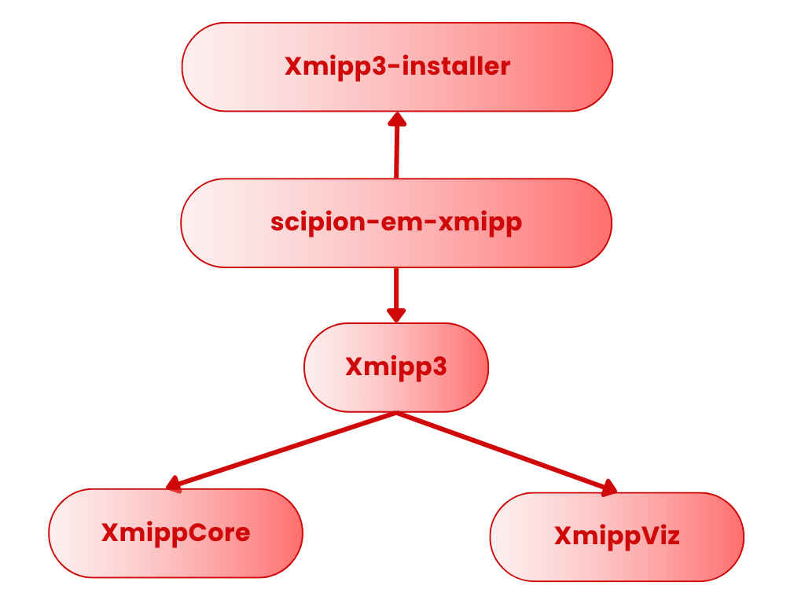

==========================================
Xmipp Release Procedures
==========================================

This document describes how to manage versions and releases for the different
components of the Xmipp ecosystem: xmipp3-installer, scipion-em-xmipp,
xmipp3, xmippCore and xmippViz.

xmipp3-installer 🗃️
-------------------

xmipp3-installer packages the Xmipp binaries and is published on PyPI.
It is automatically installed by the Scipion plugin scipion-em-xmipp.

Release Generation
~~~~~~~~~~~~~~~~~~
Releases are produced via the GitHub manual action:

``Generate release (Pypi, tag, & GitHub Release)``

Executing this action will:

- Upload a new version to PyPI `<https://pypi.org/project/xmipp3-installer/>`_
- Create the corresponding Git tag and GitHub Release.

Installation Through Scipion
~~~~~~~~~~~~~~~~~~~~~~~~~~~~
The scipion-em-xmipp plugin installs it using its ``requirements.txt``:

.. code-block:: text

   xmipp3-installer==1.*

scipion-em-xmipp 🗃️
-------------------

This is the Scipion plugin that integrates Xmipp into Scipion.

Steps to Create a New Release
~~~~~~~~~~~~~~~~~~~~~~~~~~~~~
1. **Update the changelog**

   Edit ``changelog.md`` with the new version and a list of changes.

2. **Update the version**

   Modify the ``__version__`` variable in:

   .. code-block:: text

      scipion-em-xmipp/xmipp3/version.py

3. **Run the GitHub Release action**

   Trigger the manual action ``Release``.
   This will:

   - Upload the new version to `PyPI <https://pypi.org/project/scipion-em-xmipp/>`_
   - Create a new Git tag and GitHub Release.

Major Xmipp Version Changes
~~~~~~~~~~~~~~~~~~~~~~~~~~~
If the **major version of Xmipp** changes, update these fields:

.. code-block:: text

   scipion-em-xmipp/xmipp3/version.py
       _binVersion
       _binTagVersion

Use the `Protein cataloge for Xmipp releases name <https://i2pc.github.io/docs/Developers/HowToRelease2.0/index.html#protein-catalog-for-xmipp-releases-naming>`_

xmipp3 🗃️
-----------

Top-level Xmipp distribution, bundling submodules such as xmippCore and
xmippViz.

Version Updates
~~~~~~~~~~~~~~~
Edit the version information in:

.. code-block:: text

   xmipp/version-info.json

The fields to modify are:

- ``version_number``
- ``version_name``: only when the **major version** changes. Use the `Protein cataloge for Xmipp releases name <https://i2pc.github.io/docs/Developers/HowToRelease2.0/index.html#protein-catalog-for-xmipp-releases-naming>`_
- ``release_date``

If xmippCore or xmippViz increase their **major** version, update their
version references inside ``version-info.json``.

Release Procedure
~~~~~~~~~~~~~~~~~
1. Update ``changelog.md`` with the new version and changes.
2. Trigger the GitHub manual action ``Release`` to Create a new Git tag and Publish a GitHub Release

xmippCore 🗃️
------------

Core Xmipp libraries and algorithms.

Steps to Create a New Release
~~~~~~~~~~~~~~~~~~~~~~~~~~~~~
1. Add a new section in ``changeLOG.md`` including Version number and Description of changes

2. Trigger the ``Release`` GitHub manual action to generate a new Git tag
  

xmippViz 🗃️
-----------

Purpose
~~~~~~~
Visualization module for Xmipp.

Steps to Create a New Release
~~~~~~~~~~~~~~~~~~~~~~~~~~~~~
1. Add the new version and changes to ``changeLOG.md``  including Version number and Description of changes
2. Execute the GitHub manual action ``Release`` to create the new tag
 

🧬 Protein Catalog for Xmipp releases naming 🧬
-------------------------------------------------------

A
~

Actin – Cell structure and movement

Apoferritin – Iron storage scaffold protein

ATP synthase – Produces ATP from ADP

B
~

Bacteriorhodopsin – Light-driven proton pump

Beta-tubulin – Microtubule structural protein

Biotin carboxylase – Catalyzes carboxylation reactions

C
~

Cas9 – DNA cutting enzyme

CFTR – Chloride ion channel

Clathrin – Vesicle formation protein

D
~

Dynein – Moves cargo along microtubules

DNA polymerase – DNA replication enzyme

Dicer – Processes microRNA precursors

E
~

Elastin – Provides tissue elasticity

Electron transfer flavoprotein – Transfers electrons in mitochondria

Elongation factor 2 – Assists protein translation

F
~

Ferritin – Iron storage protein

Fibrinogen – Blood clot formation

Flagellin – Builds bacterial flagella

G
~

GAPDH – Glycolysis enzyme

GroEL – Protein folding chaperone

GPCR – Signal reception and transduction

H
~

Hemoglobin – Oxygen transport

Histone – DNA packaging protein

Hsp90 – Protein folding chaperone

I
~

Integrin – Cell adhesion receptor

Immunoglobulin G – Antibody immune defense

Ion channel TRPV1 – Heat/pain sensor channel

K
~

Keratin – Structural hair/nail protein

Kinesin – Microtubule cargo transport

Kinase (PKA) – Phosphorylates target proteins

L
~

Lactate dehydrogenase – Converts lactate to pyruvate

Laminin – Extracellular matrix structural protein

Lipase – Breaks down fats

M
~

Myosin – Motor protein for movement

Myoglobin – Oxygen storage in muscles

Mitochondrial complex I – Electron transport in mitochondria

N
~

NADH dehydrogenase – Oxidizes NADH in mitochondria

Na⁺/K⁺-ATPase – Maintains ion gradients

Nucleosome – DNA wound around histones

O
~

Opsin – Light-detecting protein

Outer membrane porin – Small molecule transport

Oxytocin – Hormone, induces contractions

P
~

p53 – Tumor suppressor

Photosystem II – Splits water in photosynthesis

Proteasome – Degrades unwanted proteins

R
~

Ribosome – Protein synthesis machine

RNA polymerase II – Transcribes mRNA

Rubisco – Fixes carbon dioxide

S
~

Spike (SARS-CoV-2) – Virus entry protein

Sec61 translocon – Inserts proteins into ER

Synapsin – Regulates neurotransmitter release

T
~

Tubulin – Microtubule building block

Troponin – Regulates muscle contraction

TRPV1 – Heat/pain sensory channel

U
~

Ubiquitin – Marks proteins for degradation

Urease – Breaks down urea

Uncoupling protein – Dissipates mitochondrial proton gradient

V
~

V-ATPase – Acidifies organelles

Vinculin – Connects cytoskeleton to membrane

Voltage-gated sodium channel – Action potential initiation

W
~

Wnt protein – Cell signaling and development

Wee1 kinase – Controls cell cycle

Wilms tumor protein (WT1) – Kidney development regulator

Y
~

YAP – Transcription coactivator, growth

Y-box binding protein – Regulates transcription and translation

Z
~

Zinc finger protein – DNA binding protein

ZO-1 – Tight junction scaffolding