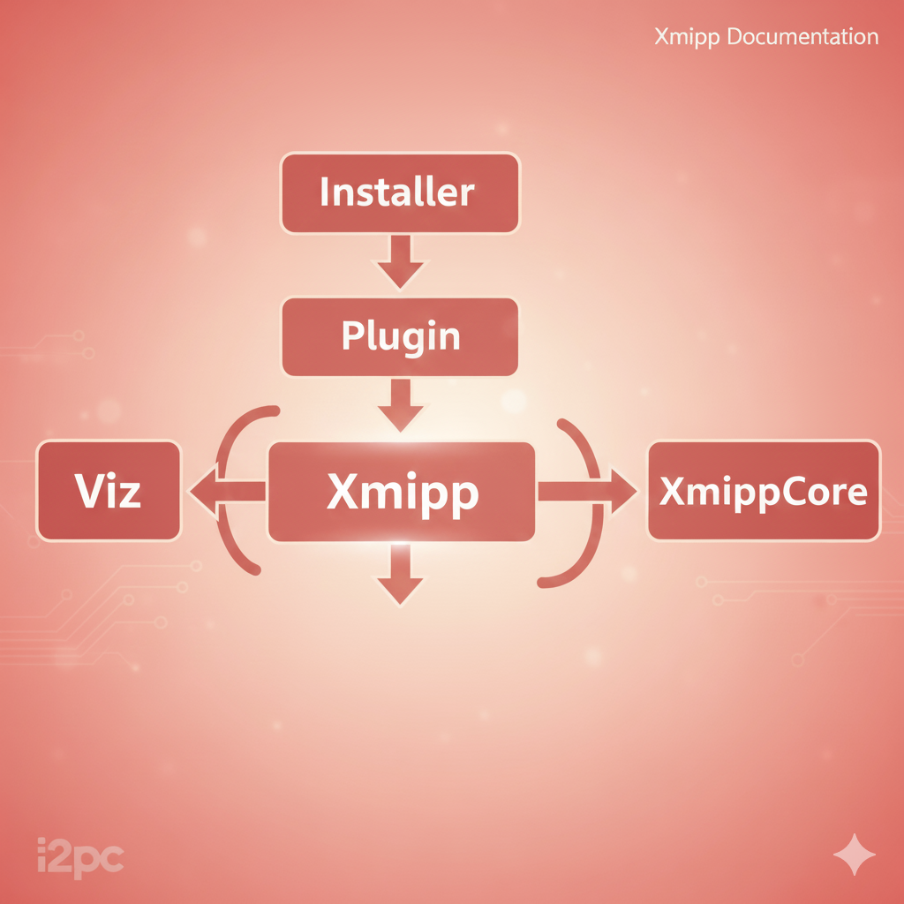

==========================================
Creating a Xmipp Release (new insataller)
==========================================

Dependencies diagram
---------------------

🧬  Protein Catalog for Xmipp releases naming 🧬
----------------------------------------------------

A
~

Actin – Cell structure and movement

Apoferritin – Iron storage scaffold protein

ATP synthase – Produces ATP from ADP

B
~

Bacteriorhodopsin – Light-driven proton pump

Beta-tubulin – Microtubule structural protein

Biotin carboxylase – Catalyzes carboxylation reactions

C
~

Cas9 – DNA cutting enzyme

CFTR – Chloride ion channel

Clathrin – Vesicle formation protein

D
~

Dynein – Moves cargo along microtubules

DNA polymerase – DNA replication enzyme

Dicer – Processes microRNA precursors

E
~

Elastin – Provides tissue elasticity

Electron transfer flavoprotein – Transfers electrons in mitochondria

Elongation factor 2 – Assists protein translation

F
~

Ferritin – Iron storage protein

Fibrinogen – Blood clot formation

Flagellin – Builds bacterial flagella

G
~

GAPDH – Glycolysis enzyme

GroEL – Protein folding chaperone

GPCR – Signal reception and transduction

H
~

Hemoglobin – Oxygen transport

Histone – DNA packaging protein

Hsp90 – Protein folding chaperone

I
~

Integrin – Cell adhesion receptor

Immunoglobulin G – Antibody immune defense

Ion channel TRPV1 – Heat/pain sensor channel

K
~

Keratin – Structural hair/nail protein

Kinesin – Microtubule cargo transport

Kinase (PKA) – Phosphorylates target proteins

L
~

Lactate dehydrogenase – Converts lactate to pyruvate

Laminin – Extracellular matrix structural protein

Lipase – Breaks down fats

M
~

Myosin – Motor protein for movement

Myoglobin – Oxygen storage in muscles

Mitochondrial complex I – Electron transport in mitochondria

N
~

NADH dehydrogenase – Oxidizes NADH in mitochondria

Na⁺/K⁺-ATPase – Maintains ion gradients

Nucleosome – DNA wound around histones

O
~

Opsin – Light-detecting protein

Outer membrane porin – Small molecule transport

Oxytocin – Hormone, induces contractions

P
~

p53 – Tumor suppressor

Photosystem II – Splits water in photosynthesis

Proteasome – Degrades unwanted proteins

R
~

Ribosome – Protein synthesis machine

RNA polymerase II – Transcribes mRNA

Rubisco – Fixes carbon dioxide

S
~

Spike (SARS-CoV-2) – Virus entry protein

Sec61 translocon – Inserts proteins into ER

Synapsin – Regulates neurotransmitter release

T
~

Tubulin – Microtubule building block

Troponin – Regulates muscle contraction

TRPV1 – Heat/pain sensory channel

U
~

Ubiquitin – Marks proteins for degradation

Urease – Breaks down urea

Uncoupling protein – Dissipates mitochondrial proton gradient

V
~

V-ATPase – Acidifies organelles

Vinculin – Connects cytoskeleton to membrane

Voltage-gated sodium channel – Action potential initiation

W
~

Wnt protein – Cell signaling and development

Wee1 kinase – Controls cell cycle

Wilms tumor protein (WT1) – Kidney development regulator

Y
~

YAP – Transcription coactivator, growth

Y-box binding protein – Regulates transcription and translation

Z
~

Zinc finger protein – DNA binding protein

ZO-1 – Tight junction scaffolding