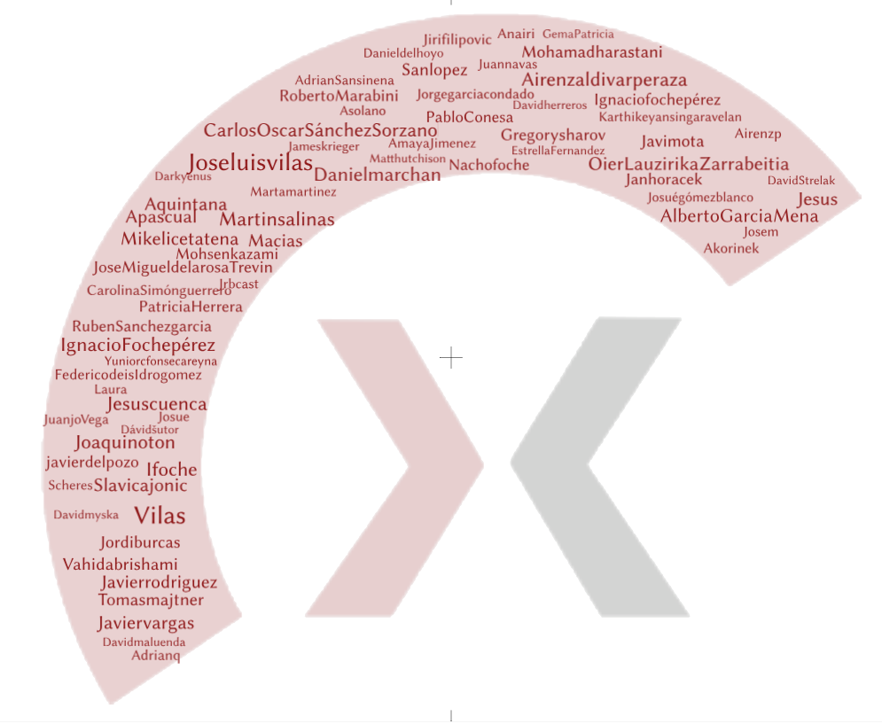

Welcome Developers! 👋
======================

Hello there, and welcome to the **Xmipp Developer Community**! 🚀 We're thrilled to have you here. Whether you're a seasoned contributor or just getting started, this is the place to collaborate, innovate, and help improve the Xmipp ecosystem.

Who are we? 
--------------
The Xmipp community is a vibrant and dynamic group of developers from around the world. We collaborate on various tools and modules that make up Xmipp, a powerful software suite for image processing in electron microscopy.

Here's a snapshot of our community in action:  `Commits this month <https://github.com/I2PC/xmipp/pulse/monthly>`__ 🖋️ `Contributors over time <https://github.com/I2PC/xmipp/graphs/contributors>`__  👥

We're proud to be a relatively large and active group of contributors, constantly pushing updates, reviewing pull requests (PRs), and tackling issues.

Our GitHub Repositories 
--------------------------
Here are the main repositories where all the magic happens:
- `xmipp <https://github.com/I2PC/xmipp>`__ : The core repository of the Xmipp project. (C++)
- `xmippCore <https://github.com/I2PC/xmippCore>`__ : Core functionalities of Xmipp. (C++)
- `xmippViz <https://github.com/I2PC/xmippViz>`__ : Tools for visualization and analysis.
- `scipion-em-xmipp <https://github.com/I2PC/scipion-em-xmipp>`__ : With all the protocols for Scipion (python)
Feel free to explore, clone, and experiment with our repositories! If you encounter bugs or have feature requests, please **open an issue** in the relevant repository. We welcome and encourage all contributions! 🙌

Contributing: What you need to know 
--------------------------------------
- **Pull Requests (PRs)**: We actively review PRs and aim to merge improvements as quickly as possible. 🎉
- **New to Xmipp Development?**: If you're contributing for the first time, we recommend reaching out to us before starting your work. That way, we can guide you and ensure you're set up for success.  
  Visit our `Contact Page <https://i2pc.github.io/docs/contact.html>`__ for more details.

Pro Tips for Contributors 
----------------------------
- Always clone the repository and work on a separate branch for your changes. 
- Name the branch with your initials 
- Add meaningful commit messages to make it easier for everyone to follow your work.
- Review our existing issues before starting a new one—chances are, someone else is already on it! 🕵️

Join us and be part of something amazing! 
--------------------------------------------
We're excited to see what you'll bring to the Xmipp ecosystem. Dive in, collaborate, and let's create something incredible together. If you have any questions, don't hesitate to reach out—we're here to help!

Happy coding! 

