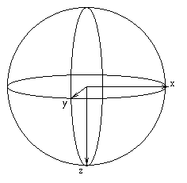

Conventions
===============
Projections with Euler Angles
------------------------------
The problem addressed here is given any set of Euler angles to know what is the projection that Xmipp (and Spider) will associate to them. The Euler angles are defined as follow:
+------------------------+----------------+-------------------+
| Columna 1              | Columna 2      | Columna 3         |
+========================+================+===================+
| rotational or azimuthal| First rotation | Around Z axis     |
+------------------------+----------------+-------------------+
| tilting                | Second rotation| Around new Y axis |
+------------------------+----------------+-------------------+
| psi                    | Second rotation| Around new Z axis |
+------------------------+----------------+-------------------+

All angles are measured using the left hand thumb rule (when aligning the left hand thumb with the rotation axis, positive angles are measured according to the direction of the rest of the fingers).

There is an approach which consists of rotating the volume according to the Euler angles and then projecting from Z-axis. An alternative one, and the one I have followed and found more practical is to move the view point (or better said the projection plane) according to the Euler Angles. Both ways will be explained here.

First, the way Xmipp define the coordinate axes is like this. 

Moving the projection plane
~~~~~~~~~~~~~~~~~~~~~~~~~~~

The idea is to define a projection plane and move it around the volume until we get the desired point of view. It would seem that we had to make the rotations in the same order as they are defined in the Euler angles but it is not totally true. We can interchange tilt and rotation to make an easiest method to get manually the projection. I will describe a chain of steps in order to get the projection.

**Getting Started**

1)Construct a projection plane: take a little piece of paper and mark on it the image coordinate system will define the orientation of the projection. We will look the projection in the orientation just as it is shown. 

.. figure:: ../../../_static/images/Euler/Euler2.gif
   :alt: Euler2
   :width: 200
   :align: center

2) Our point of view is defined just now for a little point on the bottom of the sphere, while the projection plane is just on the opposite side. 

.. figure:: ../../../_static/images/Euler/Euler3.gif
   :alt: Euler3
   :width: 200
   :align: center

**We begin now to read eulerian angles**
3) TILT:
move the point of view as many degrees as necessary towards right (positive tilting angles) or left (negative tilting angles). Projection plane must move as if the system point_of_view-plane_of_projection were a whole.For example, 90º of tilting would be 

4) ROTATIONAL (AZIMUTHAL) ANGLE:
move the point of view towards you (positive azimuthal angles) or away from you (negative azimuthal  angles) (Notice that this directions are simplifications for when tilting angles are positive, you must keep in mind the direction of turn and not the description of towards or away from you. If tilt angle is negative this directions are reversed in respect to you but not in the direction of turn).  For example from the above situation of tilt=90, now let's take rotational=90. The new situation would be 

.. figure:: ../../../_static/images/Euler/Euler5.gif
   :alt: Euler5
   :width: 200
   :align: center
5) PSI:
for taking psi into account we must turn the projection plane together with the point of view. Looking from the point of view positive psi angles turns counterclockwise. For example, psi=90, would give, 

.. figure:: ../../../_static/images/Euler/euler6.gif
   :alt: Euler6
   :width: 200
   :align: center

**PROJECTING**
Now we have to project the volume on the projection plane. As an example I have defined a volume which has got a sphere along y-axis, a larger ellipsoid along z-axis and a cylinder along x-axis as you can see in the next figure. If we project for (tilt=90, rot=90, psi=90) we would obtain the following by direct projection 

.. figure:: ../../../_static/images/Euler/Euler7.gif
   :alt: Euler7
   :width: 200
   :align: left

.. figure:: ../../../_static/images/Euler/Euler8.gif
   :alt: Euler8
   :width: 200
   :align: right

But as we know that our projection plane always has got its reference with X axis facing to the right and the Y axis looking down, we should rotate the projection obtained until it is well-referenced 

+----------------------------------+----------------------------------+
| .. figure:: ../../../_static/images/Euler/Euler9.gif      | ../../../_static/images/Euler/Euler10.gif    |
|    :width: 200                    |    :width: 200                    |
|    :align: center                 |    :align: center                 |
|                                  |                                  |
|    Descripción de la imagen 1     |    Descripción de la imagen 2     |
+----------------------------------+----------------------------------+

 In the las figures we can check the consistency of this reasoning. The projection with tilt=90, rot=90, psi=90 has been taken with SPIDER. As we can see the results are identical. 

**PROJECTING in a more Euler fashion**

So far we have devised a method to manually compute projections using a piece of paper and a fixed phantom. But this is not the way really they are taken. In this part we will move the phantom and letting the projection plane fixed. We start again from the same initial point as before. Now we will move the internal reference axes in the reverse order (click here for further information for why this is like that).

Starting Point: 

.. figure:: ../../../_static/images/Euler/Euler11.gif
   :alt: Euler11
   :width: 200
   :align: center

3) PSI ANGLE

The rotational angle is the first Euler angle to measure, around Z. It is a left hand angle, so if the left hand thumb is aligned with Z then positive angles are measured in the direction of the rest of the fingers. We will develop the same example as before, so the new internal reference axes are 

4) TILTING ANGLE

The tilting angle is a left handed turn around Y, but the new Y!!!. Applying tilt=90 in our example we get 

5) ROTATIONAL ANGLE

Finally the third angle is again a left handed turn around Z, again the new one!!!. Using rot=90 we finally get 

.. figure:: ../../../_static/images/Euler/Euler14.gif
   :alt: Euler14
   :width: 200
   :align: center

**FACTS ABOUT THE EULER MATRIX and SPIDER**

    These projections are exactly the same as the ones provided by Spider using the same angles.
    The Euler matrix shown in Euler_angles2matrix(rot,tilt,psi,A) is obtained by RotZ(-psi)*RotY(tilt)*RotZ(-rot)

More Euler Angles
~~~~~~~~~~~~~~~~~~~~~~~~~~~

“Euler angles are a mean of representing the spatial orientation of any
system of coordinates of the space as a composition of three rotations
from a reference system of coordinates.”

-  the first rotation is denoted by phi and is around the z axis
-  the second rotation is called theta and is around the new y-axis.
-  the third rotation is denoted by psi and is around the new z axis

The three rotations may be expressed as a single 3x3 matrix called Euler
matrix

.. raw:: html

   <pre>
   r11 = cos(psi)cos(theta)cos(phi) - sin(psi)sin(phi)
   r12 = cos(psi)cos(theta)sin(phi) + sin(psi)cos(phi)
   r13 = -cos(psi)*sin(theta)

   r21 = -sin(psi)cos(theta)cos(phi) - cos(psi)sin(phi)
   r22 = -sin(psi)cos(theta)sin(phi) + cos(psi)cos(phi)
   r23 = sin(psi)*sin(theta)

   r31 = sin(theta)cos(phi)
   r32 = sin(theta)sin(phi)
   r33 = cos(theta)

   where the first index refers to rows and the second to columns </pre>

Apositive rotation implies a clockwise rotation of the OBJECT or a
anti-clockwise rotation of the system of coordinates

Euler angles in Xmipp complies with the 3DEM standard (see
http://www.ebi.ac.uk/pdbe/docs/3dem/test_image/3DEM_compliance for
details)

Filenames
------------------------------

In general, Xmipp can manage any Filename you can think of. However,
there are some ideas that could help you to organize your data, and
which might tell you more about the file only by its name. We could
divide files in several classes:

.. raw:: html

   <table>

.. raw:: html

   <tr>

.. raw:: html

   <th>

Data type

.. raw:: html

   </th>

.. raw:: html

   <th>

Suggested extension

.. raw:: html

   </th>

.. raw:: html

   <th>

Suggested filenames

.. raw:: html

   </th>

.. raw:: html

   </tr>

.. raw:: html

   <tr>

.. raw:: html

   <td>

Images

.. raw:: html

   </td>

.. raw:: html

   <td>

.xmp

.. raw:: html

   </td>

.. raw:: html

   <td>

g1ta000001.xmp

.. raw:: html

   </td>

.. raw:: html

   </tr>

.. raw:: html

   <tr>

.. raw:: html

   <td>

Volumes

.. raw:: html

   </td>

.. raw:: html

   <td>

.vol or .xmp

.. raw:: html

   </td>

.. raw:: html

   <td>

art000001.vol, wbp000001.vol, sirt000001.vol

.. raw:: html

   </td>

.. raw:: html

   </tr>

.. raw:: html

   <tr>

.. raw:: html

   <td>

Selection Files

.. raw:: html

   </td>

.. raw:: html

   <td>

.sel

.. raw:: html

   </td>

.. raw:: html

   <td>

g1t.sel

.. raw:: html

   </td>

.. raw:: html

   </tr>

.. raw:: html

   <tr>

.. raw:: html

   <td>

Document Files

.. raw:: html

   </td>

.. raw:: html

   <td>

.doc

.. raw:: html

   </td>

.. raw:: html

   <td>

angles.doc

.. raw:: html

   </td>

.. raw:: html

   </tr>

.. raw:: html

   </table>

The class [[FileName]] assumes a filename structure as in
g1ta000001.xmp, ie, a filename root (g1ta), a number (000001) and an
extension (xmp) (“.”); although it can also manage names as g1ta00001 or
g1ta00001.xmp.bak. To mantain compatibility with Spider it is required
that image numbers start at 1, and if possible that all images have got
correlative numbers, but these last conditions are not compulsory within
Xmipp, it’s just for compatibility with Spider.

Notice also that Spider requires all data files (volumes, images,
document files, …) to have the same extension. You might prefer this
other convention if you don’t want to make copies of the files, or to
have to rename the files before entering in Spider. 

Logical access
------------------------------

The basic multidimensional classes implemented in this library admit two
kinds of access: physical and logical. The physical positions are those
indexes of the pixel inside the C matrix. Just an example, suppose we
have a 65x65 image, then the physical indexes range from 0 to 64, being
I[0][0] (if this could be written) the first pixel stored. However, we
might be interested in writing procedures in a more mathematical fashion
trying to access negative indexes (or even fractional onesSee
[[ImageOver]]) This conception is very useful when you want to represent
a discretized plane whose origin is at the center of the image, for
instance. So, you can express in a simpler way your algorithms without
having to make a by hand translation from the logical positions to the
physical ones.

Suppose now that we are interested to have the logical origin at the
center of the image 65x65, ie, at physical position [32][32]. This would
mean that the physical position [0][0] is now at logical position
(-32,-32), and the logical indexes range now from -32 to 32.

This logical index defintion is done by means of the starting indexes of
matrices (see matrix2D) where you can define which logical position is
occupying the first physical pixel, ie,

.. raw:: html

   <pre>
   I().startingY()`-32; 
   I().startingX()`-32; 
   </pre>

From now on you can start to access to logical positions even with
negative indexes. The usual way of establishing loops inside this
logical images is by using the starting and finishing information of its
axes

.. raw:: html

   <pre>  
       Image I(65,65);
       I().init_random();
       float sum=0;
       for (int i=STARTINGY(I()); i<=FINISHINGY(I()); i++)
           for (int j=STARTINGX(I()); j<=FINISHINGX(I()); j++) {
                  sum += I(i,j);
               // sum += IMGPIXEL(i,j);
           }
   </pre>

Although the previous example has been used using the class Image, the
logical access rely on the classes matrix1D, matrix2D, and matrix3D, and
all the concepts explained for images are extensible for vectors and
volumes. The related functions are STARTINGX, STARTINGY, STARTINGZ,
FINISHINGX, FINISHINGY, FINISHINGZ, IMGPIXEL, DIRECT_IMGPIXEL, VOLVOXEL,
DIRECT_VOLVOXEL, VEC_ELEM, MAT_ELEM, VOL_ELEM, DIRECT_VEC_ELEM,
DIRECT_MAT_ELEM, DIRECT_VOL_ELEM

Pay attention to the index order when pointing to a pixel, first you
have to give the most outer coordinate (which is the less varying one in
the actual implementation), and then increase the coordinate. For
volumes the usual way of making a loop is

.. raw:: html

   <pre>
       Volume V(65,65,65);
       V().init_random();
       float sum=0;
       for (int k=STARTINGZ(V()); k<=FINISHINGZ(V()); k++)
          for (int i=STARTINGY(I()); i<=FINISHINGY(I()); i++)
              for (int j=STARTINGX(I()); j<=FINISHINGX(I()); j++) {
                  sum +=V(k,i,j);
           }
   </pre>

Notice that if you don’t modify the origin of the multidimensional array
then the physical and logical accesses are the same. 

Image center
------------------------------

There is a special case for the logical access when the origin is set
just at the center of the image, volume or vector. There are several
definitions of center of the image, the one used here is the physical
position ((int)ydim/2, (int)xdim/2). This is the same convention used in
Spider and has been chosen to mantain compatibility with that package.
Remember that in C (int) takes the integer part of the number, for
example, for 2.3 and 2.8 the integer part is 2, while for -2.3 and -2.8
the integer part is -2.

This means that for images with an even dimension, the center will be
“displaced” in that direction. Let’s have a look on the following two
diagrams of cell indexes.
