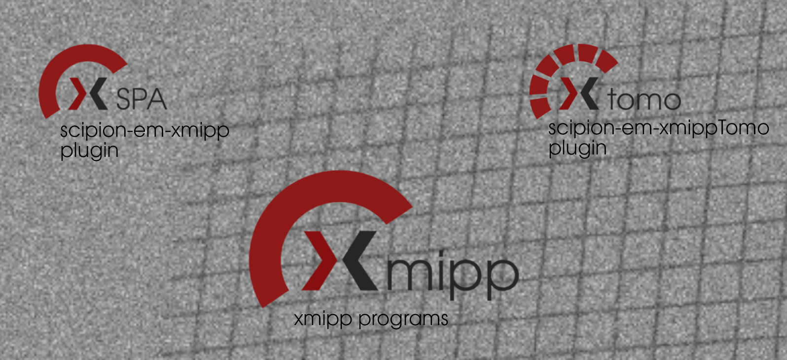

.. figure:: ../_static/images/xmipp_noBackground.png
   :alt: xmipp logo
   :width: 400

Welcome to Xmipp documentation!
========================================
Xmipp is a suite of image processing programs, primarily aimed at single-particle 3D electron microscopy, 
designed and managed by the `Biocomputing Unit <http://biocomputingunit.es/>`_ located in Madrid, Spain.

The Xmipp project is made up by the `xmipp programs <https://github.com/I2PC/xmipp>`_, mainly written in C++, the `scipion-em-xmipp <https://github.com/I2PC/scipion-em-xmipp>`_ plugin, where all the protocols of SPA  are located and the `scipion-em-xmippTomo <https://github.com/I2PC/scipion-em-xmipptomo>`_ plugin, where all the protocols of tomography are located . 

Getting started
----------------
Xmipp is composed by a main repository with all the programs writen by C++ and two plugins to run protocols inside Scipion. To run the protocols the compillation of
the main repository is required and also the installation of the plugins.

.. _Installation-docs:

.. toctree::
    :maxdepth: 1
    :hidden:
    :caption: Installing Xmipp

    Installation/Requirements/index
    Installation/Installation/index
    Installation/Optionals/index
    Installation/troubleshooting/index

    

.. _Releases-docs:

  .. toctree::
    :maxdepth: 1
    :hidden:
    :caption: Releases

    Releases/Releases-xmipp-program/index
    Releases/Releases-scipion-em-xmipp/index
    Releases/Releases-scipion-em-xmippTomo/index
    
.. _Utils-docs:

  .. toctree::
    :maxdepth: 1
    :hidden:
    :caption: Utils

    Utils/ConfigurationF/index
    Utils/xmippStructure/index
    Utils/Conventions/index
    Utils/Deprecated-programs/index

.. _Developers-docs:

  .. toctree::
    :maxdepth: 1
    :hidden:
    :caption: Developers

    Developers/Welcome-developers/index
    Developers/Guidelines/index
    Developers/Integrating-with-Visual-Studio/index
    Developers/CodeDocumentation/index
    Developers/Checkout-specific-date/index
    Developers/ParallelPrograming/index
    Developers/xmipp-Binding/index
    Developers/testing-with-google-C++/index
    Developers/UsefulScripts/index
    Developers/How-to-release/index
    

  .. toctree::
    :maxdepth: 1
    :hidden:
    :caption: Others
    
    listOfPublications
    enhancingXmipp
    contact
    license
