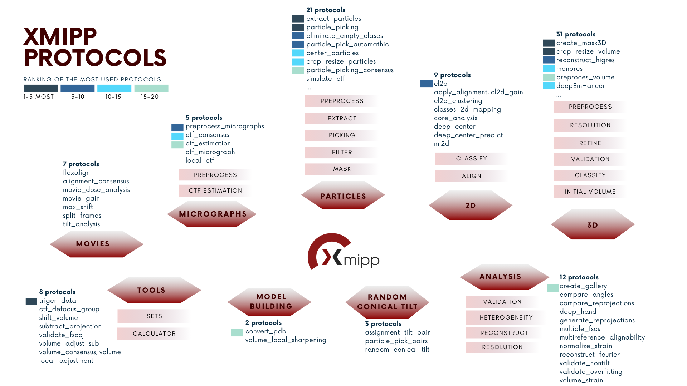

Protocols Map
===============

This interactive diagram shows Xmipp protocols organized by a hierarchy of *tags* (Level 1 → Level 2 → Level 3) and their relationships to each protocol.
Data comes from the current devel status (2/09/2025)

.. raw:: html

   <iframe src="_static/protocolsView.html" width="100%" height="800px" style="border:none;">
   </iframe>

